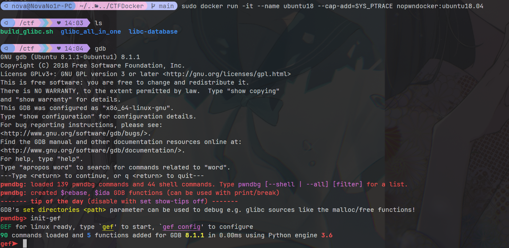

<div align="center">
  
</div>


<div align="center">

# NoPwnDocker

> **ENGLISH | [中文](README_CN.md)**

<a href="./LICENSE">
    
</a>

</div>


## Included

- [zsh](https://www.zsh.org/)
- [oh-my-zsh](https://ohmyz.sh/)
- [starship](https://starship.rs/)
- [pwntools](https://github.com/Gallopsled/pwntools)  —— CTF framework and exploit development library
- [gef](https://github.com/hugsy/gef)
- [pwndbg](https://github.com/pwndbg/pwndbg)  —— a GDB plug-in that makes debugging with GDB suck less, with a focus on features needed by low-level software developers, hardware hackers, reverse-engineers and exploit developers
- [pwngdb](https://github.com/scwuaptx/Pwngdb) —— gdb for pwn
- [ROPgadget](https://github.com/JonathanSalwan/ROPgadget)  —— facilitate ROP exploitation tool
- [one_gadget](https://github.com/david942j/one_gadget) —— A searching one-gadget of execve('/bin/sh', NULL, NULL) tool for amd64 and i386
- [seccomp-tools](https://github.com/david942j/seccomp-tools) —— Provide powerful tools for seccomp analysis
- [ltrace](https://linux.die.net/man/1/ltrace)      —— trace library function call
- [strace](https://linux.die.net/man/1/strace)     —— trace system call

## How to use?

### Compose
```bash
git clone https://github.com/Nova-Noir/NoPwnDocker
cd NoPwnDocker
sudo docker compose up -d
sudo docker exec -it nopwndocker:ubuntu20.04 /bin/zsh
```

> It might takes 30+ minutes depends on your computer performance
> It will use 8GB~ of your disks.

Put your challenges and custom libc into folder `challenge`

### Manual

```bash
git clone https://github.com/Nova-Noir/NoPwnDocker
cd NoPwnDocker
docker build . -t nopwndocker:ubuntu22.04 \
       --build-arg image=ubuntu22.04 --build-arg proxy=http://172.17.0.1:7890 --build-arg python-version=3.11.5
docker run -it \
           --platform linux/amd64 \
           --security-opt seccomp:unconfined \
           --cap-add SYS_PTRACE \
           --add-host host.docker.internal:host-gateway \
           -v "$(pwd)/challenge:/home/nopwn" \
           --tty nopwndocker:ubuntu22.04
```


## Configuration

There's not much can be modified. But you do can change something.

- open `Dockerfile`, you can change the version and proxy.
- open `docker-compose.yml`, you can change the container name.
- modify `starship.toml` to use your own starship style.
- modify `.gdbinit` to use your own gdbinit config.


## Usage or features

### gdb

`init-gef`、`init-pwndbg` to load different gdb plugin.

### zsh

`zsh-autosuggestions` plugins

### build_glibc

A shell file to build glibc source with debug in one command.
`bash ~/build_glibc.sh -h`

> There could be some bug when building older version of glibc.
> Check below to see the solution. (at least for me)
 
#### `loc1@GLIBC_2.2.5' can't be versioned to common symbol 'loc1'
 
see https://patchwork.ozlabs.org/project/glibc/patch/20170623161158.GA5384@gmail.com/


## Update Log

### 2023/10/02

:recycle: Refactor Dockerfile and docker-compose.yml

### 2023/03/23  

:fire: Remove `build_glibc32.sh` and `build_glibc64.sh`, add `build_glibc.sh` for general usage. 
:fire: Remove built-in glibc to reduce the docker size and build time.